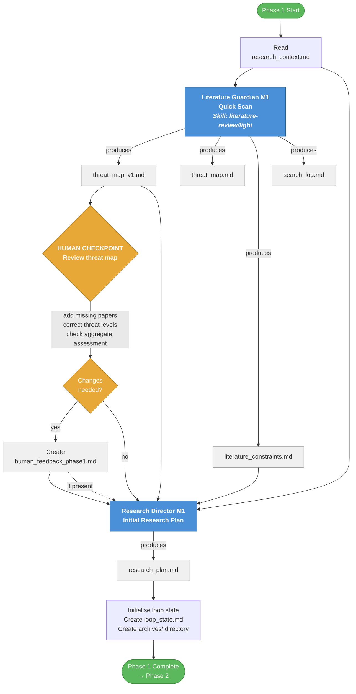

# Phase 1: Pre-Loop — Pipeline Flowchart

## Overview

Phase 1 bootstraps the research project. It runs once before the planning loop
begins. The output is an initial research plan informed by a literature scan and
(optionally) human corrections.

**Agents involved:** Literature Guardian (M1), Research Director (M1), Human

---

## Flowchart



---

## Step-by-step detail

### Step 1.1 — Literature Guardian M1 (Quick Scan)

| | |
|---|---|
| **Agent** | Literature Guardian, Mode 1 |
| **Skill** | `.claude/skills/literature-review/light/SKILL.md` |
| **Reads** | `context/research_context.md` |
| **Produces** | `context/literature/threat_map_v1.md`, `context/literature/threat_map.md`, `context/literature/constraints.md`, `context/literature/search_log.md` |

The Literature Guardian scans the literature for papers related to the research
idea. It classifies each paper as HIGH / MODERATE / LOW threat based on
mechanism overlap. The threat map and gap analysis become the primary inputs for
the Research Director.

### Step 1.1b — Human Checkpoint

| | |
|---|---|
| **Actor** | Human researcher |
| **Reads** | `context/literature/threat_map_v1.md` |
| **Optionally produces** | `context/human_feedback_phase1.md` |

The most important checkpoint in the pipeline. The human reviews the threat map
for:
1. Missing papers the scan didn't find
2. Misclassified threat levels
3. Whether the aggregate assessment matches intuition
4. Whether `research_context.md` itself needs updating

If corrections are needed, they go into `human_feedback_phase1.md`.

### Step 1.2 — Research Director M1 (Initial Plan)

| | |
|---|---|
| **Agent** | Research Director, Mode 1 |
| **Reads** | `context/research_context.md`, `context/literature/threat_map_v1.md`, `context/literature/constraints.md`, `context/human_feedback_phase1.md` (if present) |
| **Produces** | `context/planning/research_plan.md` |

The Research Director creates the initial research plan. The plan uses the
literature constraints (especially the gap analysis) to identify which
contributions are most defensible. Each contribution must be differentiated from
the threat map at the mechanism level.

**Plan schema sections:** Research Question, Mechanism, Contributions, Phases,
Paper Structure Map, Testable Predictions (if applicable), Open Questions.

### Step 1.3 — Initialise loop state

| | |
|---|---|
| **Actor** | Pipeline script / human |
| **Produces** | `context/loop_state.md`, `context/archives/` directory |

Creates the loop state tracker (iteration counter, score, threshold) and the
archives directory for storing evaluator feedback snapshots across iterations.

---

## File flow summary

```
research_context.md ──────────────────────────────────┐
                                                       │
    ┌────────────────────── LG M1 ◄────────────────────┘
    │
    ├─► literature/threat_map_v1.md ──┬─► HUMAN CHECKPOINT
    ├─► literature/threat_map.md      │        │
    ├─► literature/constraints.md     │   human_feedback_phase1.md (optional)
    └─► literature/search_log.md      │        │
                                      │        │
                                      ▼        ▼
                                    RD M1 ◄── research_context.md
                                      │       literature/constraints.md
                                      │
                                      └─► planning/research_plan.md
                                                │
                                                ▼
                                          Initialise loop state
                                          (loop_state.md, archives/)
                                                │
                                                ▼
                                          ── Phase 2 ──
```
